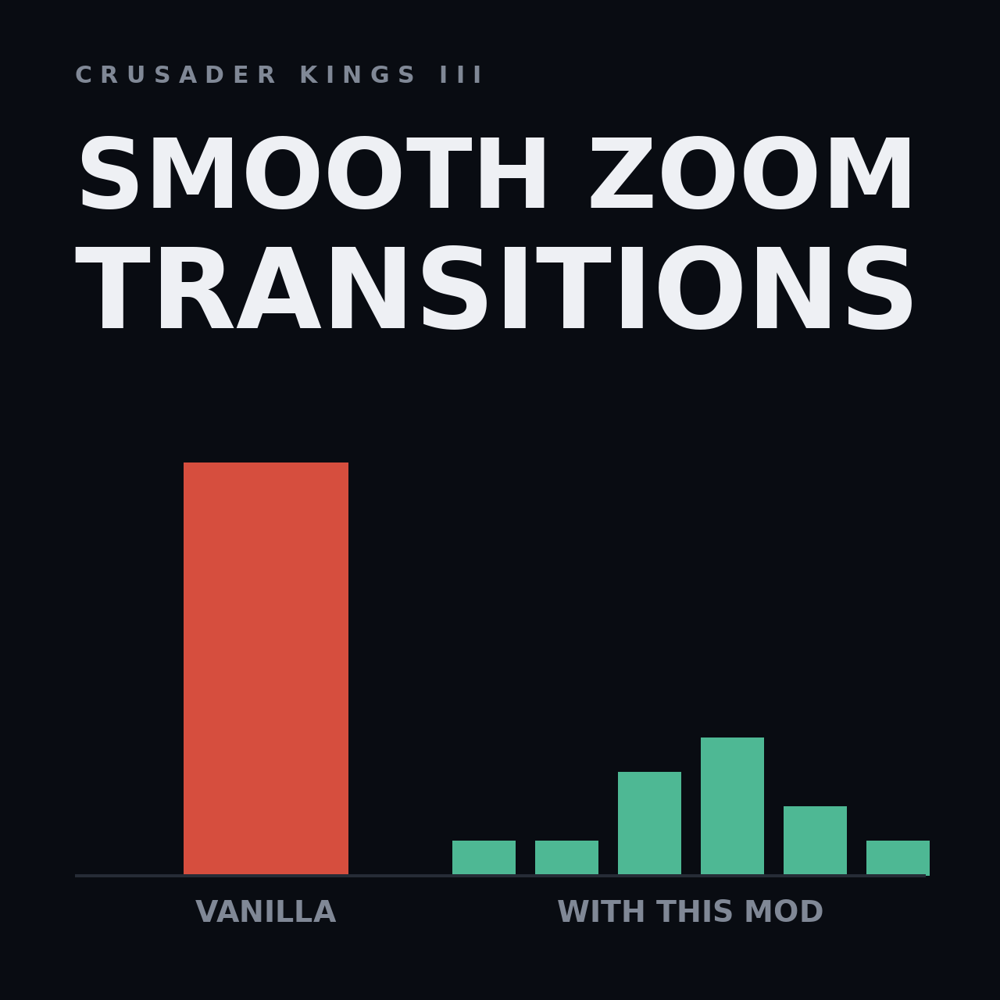

# Smooth Zoom Transitions (CK3)

Removes the two frame hitches you get while zooming the map: the one where the
terrain fills up with county colours, and the one where the map flattens and
the titles group into empires.

## Where to get

Not published yet - build it from this repository, see [Installing](#installing) below.

## Cause

It is not one expensive system. It is that vanilla schedules almost everything
on the *same* zoom step, so one frame has to do all of it.

**Zoom step 9.** Reading `game/gfx/map/map_object_data/*.txt` and
`game/common/defines/graphic/00_graphics.txt`, all of this is set to happen
there:

| what | where |
| --- | --- |
| `tree_low_layer`, `tree_medium_layer`, `tree_high_layer` unload | `layers.txt` |
| `activities_layer`, `building_layer`, `unit_layer` unload | `game_object_layers.txt` |
| `coast_foam_layer`, `env_effect_mountains_layer` unload | `effect_layers.txt` |
| fort icons hide (`FORT_VISIBLE_ZOOM_STEPS = { 0 9 }`) | `NMapIcon` |
| raid icons switch size (`DETAILED_RAID_SIMPLE_TO_DETAILED_ZOOM_STEP = 9`) | `NMapIcon` |
| map names swap small to large (`LARGE_NAMES_ZOOM_STEP = 9`) | `NMapName` |
| the realm colour overlay starts filling (`REALM_COLOR_MAP_START_ZOOM_STEP = 9`) | `NTerrainCulling` |

Twelve layers and systems torn down or swapped in the same frame, and every
one of those mesh instances gets rebuilt the moment you zoom back in, limited
only by `MAX_MESHES_LOADED_PER_FRAME = 100`.

**Zoom step 21.** `FLAT_MAP_ZOOM_STEP = 21` is also where the map table layers
fade in (`map_table_layer_*`, `fade_in = 21`), where realm capital icons hide
(`REALM_CAPITAL_VISIBLE_ZOOM_STEPS = { 0 21 }`) and where
`DISABLE_PROVINCE_AND_COUNTY_IN_FLAT_MAP = yes` throws the province and county
borders away - which means zooming back in rebuilds them.

## Fix

Nothing is removed. The work is spread over neighbouring zoom steps and the
per-frame loading budget is lowered so that what remains is amortised.

    common/defines/graphic/
      zz_smooth_zoom_01_streaming.txt   MAX_MESHES_LOADED_PER_FRAME 100 -> 50
      zz_smooth_zoom_02_step9.txt       fort/raid icons, map names and the
                                        colour overlay move off step 9
      zz_smooth_zoom_03_names.txt       cheaper map name placement search
      zz_smooth_zoom_04_flatmap.txt     icon work moves off step 21,
                                        BORDERS_FULL_UPDATE_INTERVAL 20 -> 40
      zz_smooth_zoom_05_ultrawide.txt.off   opt-in, see below

    gfx/map/map_object_data/
      game_object_layers.txt  activities 7, buildings 8, units 10
      effect_layers.txt       coast foam 6, mountain effects 7

The tree layers in `layers.txt` are deliberately left alone on step 9. That is
where players expect forests to disappear, and moving them changes how the
whole map reads while zooming, so the file is not overridden at all.
Everything that used to share the step with the trees moved instead.

Each defines file is independent, so a single group can be A/B tested by
renaming its file to `.txt.off`, reinstalling and restarting the game. The
layer files are plain tables of `fade_out` values with the vanilla numbers in
the comments, so they are easy to re-tune by hand.

### Trade-offs, stated plainly

* Holdings, activities, coast foam and mountain effects unload one or two
  steps *earlier* than vanilla, so they disappear slightly sooner than you may
  be used to. Only `unit_layer` is raised, by one step.

  An earlier version of this mod moved these the other way - 10 / 11 / 12 -
  and that was a mistake worth naming: the visible map area grows quickly as
  the camera pulls back, so keeping the holding models alive up to step 11
  meant drawing them across a far bigger slice of the map than vanilla ever
  did, and it cost frame rate exactly while zooming in towards county and
  duchy level. Layers may move down cheaply; moving them up is never free.
* Large map names appear at step 11 instead of 9, and the crossfade between
  small and large names is shorter (0.4 s instead of 0.7 s).
* The map name placement search samples less densely, so occasional names sit
  slightly differently than in vanilla.
* Full border rebuilds run half as often. Partial updates are untouched, so
  borders still follow conquests.

### Ultrawide extra (opt-in)

`NAME_DRAW_DISTANCE = 12000.0` is a radius tuned for a 16:9 frustum. On
5120x1440 far more of the map falls inside it, so the game lays out and draws
many more curved map names than it was tuned for - and that layout is exactly
what runs at a zoom transition. Rename
`zz_smooth_zoom_05_ultrawide.txt.off` to `.txt` to cut the radius to 9000.
The cost is that the most distant names near the left and right screen edges
stop being drawn.

## What this mod does not do

The colour overlay itself is not free: once it is on, every terrain pixel pays
around 39 texture fetches for the province colours, the border distance field
and the highlight layer. That is a steady frame cost from step 9 onward, not a
hitch, and it lives in `gfx/FX/pdxterrain.shader` - see the
[Sharp Terrain](https://github.com/mekedron/ck3-lowspec-terrain-fix) mod,
which owns that file.

## Layout

    descriptor.mod                       mod metadata
    thumbnail.png                        Workshop preview, must sit in the mod root
    common/defines/graphic/zz_*.txt      partial defines overrides
    gfx/map/map_object_data/*.txt        full overrides of two layer files
    install.sh                           copies the mod into the Proton prefix
    steam-workshop/                      listing texts for Steam and Paradox Mods
    tools/make_thumbnail.py              regenerates thumbnail.png
    tools/bbcode_to_plain.py             regenerates the Paradox Mods texts

## Installing

Run `./install.sh`. It copies the mod into the CK3 mod directory **inside the
Proton prefix**:

    ~/.local/share/Steam/steamapps/compatdata/1158310/pfx/drive_c/users/steamuser/
      Documents/Paradox Interactive/Crusader Kings III/mod/

That is the path the game and the Paradox launcher actually use under Proton.
`~/.local/share/Paradox Interactive/Crusader Kings III` is the native-Linux
location and is *not* read by the Proton build.

Close the launcher before installing, then start it and enable
"Smooth Zoom Transitions" in the playset. `install.sh` only places the files;
it cannot add the mod to a playset, because that lives in the launcher's own
`launcher-v2.sqlite`. A freshly installed mod shows up in the launcher's mod
list but is **not** enabled until you tick it.

## Compatibility

The defines files add keys rather than replacing `00_graphics.txt`, so they
only collide with another mod that changes the same keys.

The two files under `gfx/map/map_object_data/` are full replacements and
will conflict with any mod that adds or removes map object layers. Load this
mod before such a mod, or merge the tables by hand.

Nothing here touches shaders, so it does not conflict with
[Sharp Terrain](https://github.com/mekedron/ck3-lowspec-terrain-fix),
[Faster Trees](https://github.com/mekedron/ck3-lowspec-tree-perf) or the fog
mod.

### A Game of Thrones

AGOT ships its own `ZOOM_STEPS` (step 8 is 250 units up against vanilla's 344) and its
own `game_object_layers.txt`, with seven layers instead of three and the holding models
kept until step 16. This mod's copy of that file, loaded below AGOT, unloads the
holdings on step 8 - before AGOT's colour overlay starts - and leaves AGOT's special
buildings, roads and animals on layers it does not declare. Use
[AGOT Patch for Smooth Zoom Transitions](https://github.com/mekedron/ck3-agot-zoom-patch)
below AGOT: it is AGOT's table with the same step 9 clean-up applied to AGOT's numbers,
plus AGOT's map name step (12) restored. This mod stays enabled; its defines apply to
AGOT unchanged.

## File encoding

Every `.txt` here starts with a UTF-8 BOM, like the vanilla files. Without it
the game still reads them, but logs one
`should be in utf8-bom encoding` line per file into `logs/error.log`.

## Game version

Built against 1.19.0.6 (Scribe). After a game patch, re-diff the two layer
files against `<steam>/Crusader Kings III/game/gfx/map/map_object_data/` and
check the vanilla values quoted in the defines comments.
